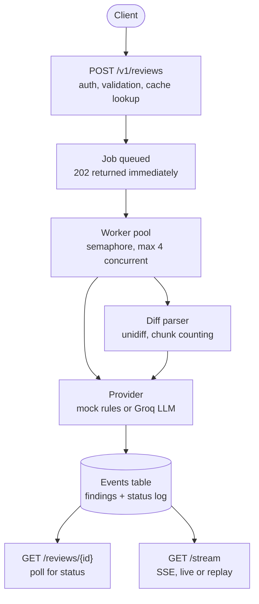
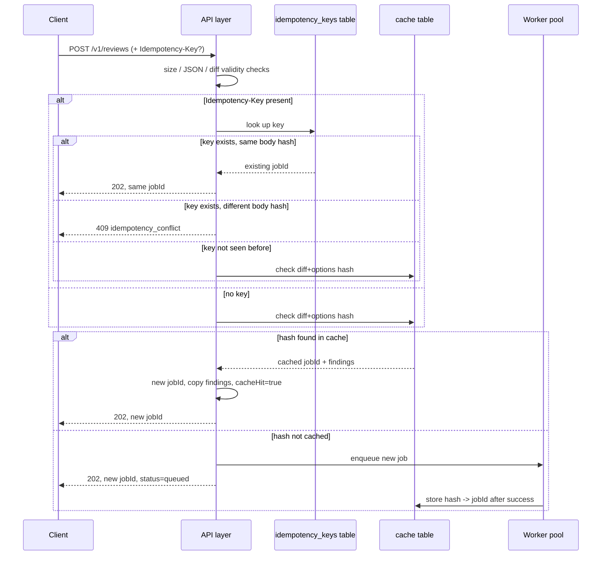
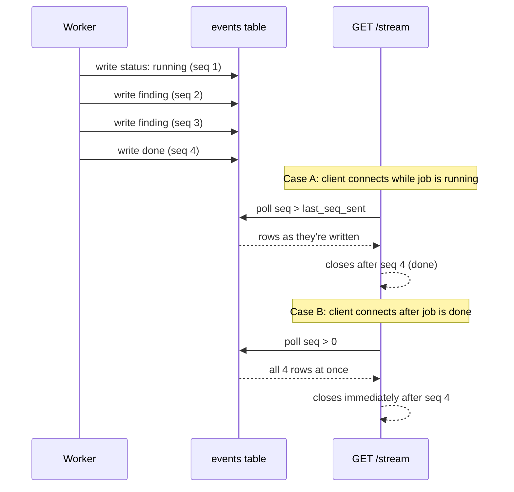
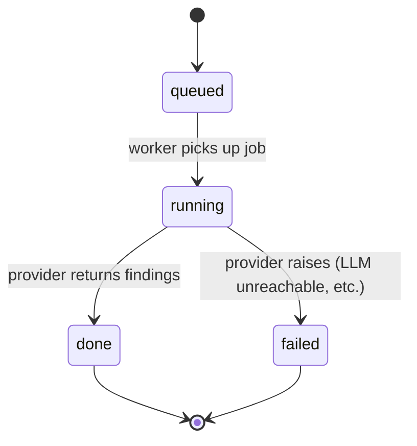

# Architecture

This document has four diagrams: the overall pipeline, what actually happens
on a `POST /v1/reviews` call, how `/stream` avoids diverging from the polling
endpoint, and the job state machine. All render directly on GitHub.

## Pipeline overview

The parser and provider are drawn as two boxes because they're two separate
modules, but they run inside the same worker call — a job never crosses a
process or queue boundary between "parsed" and "reviewed."

## Request lifecycle: POST /v1/reviews

This is the part that's easy to get wrong, since idempotency and caching are
separate checks that both have to happen before any real work starts.

## SSE: why live and replay can't drift apart

`/stream` and `GET /reviews/{id}` both read from the same `events` table.
There's no separate "live" code path — a client connecting after a job has
already finished just gets the same rows in one batch instead of trickling
in over time.

## Job state machine

A `failed` job emits a terminal `status: failed` event instead of `done` —
`/stream` treats either one as a valid signal to close the connection, so a
failing job doesn't leave a client waiting forever.